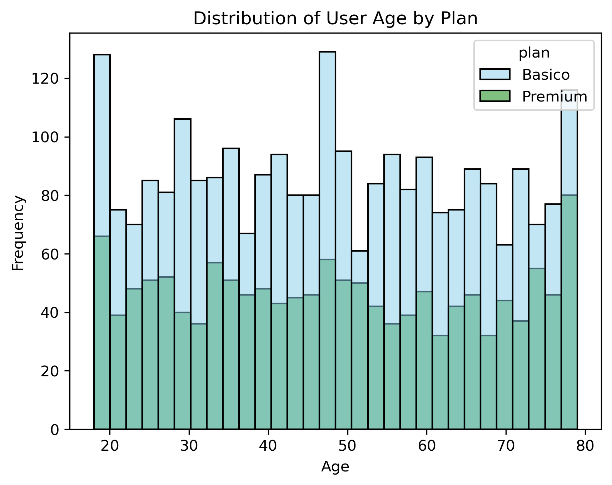
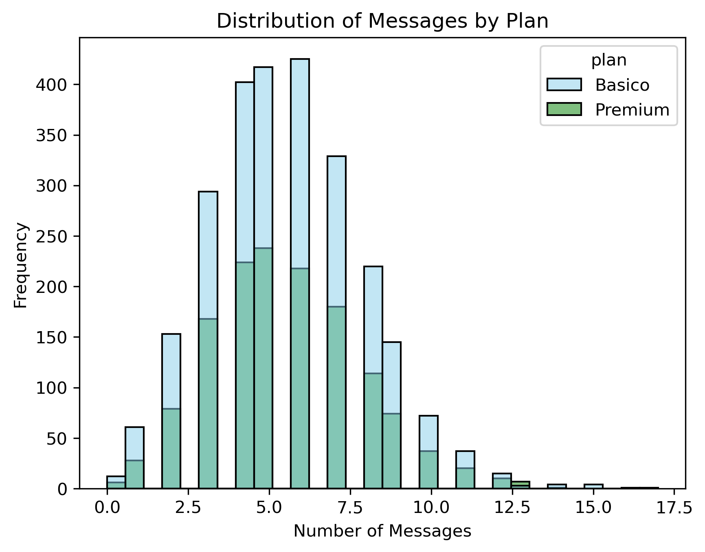
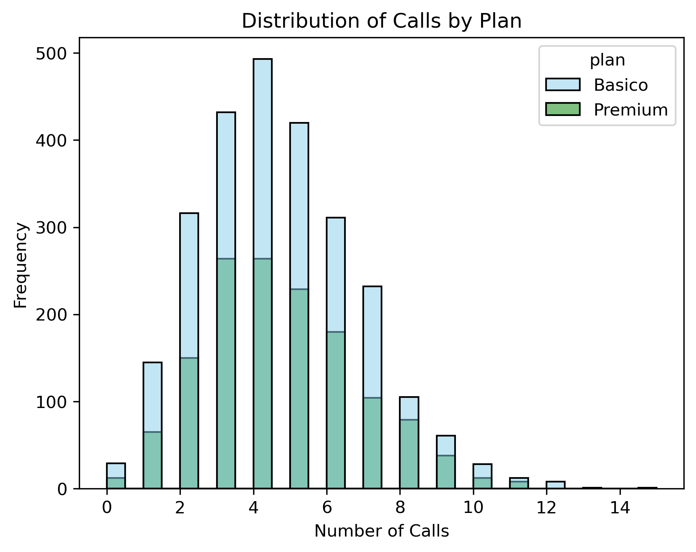
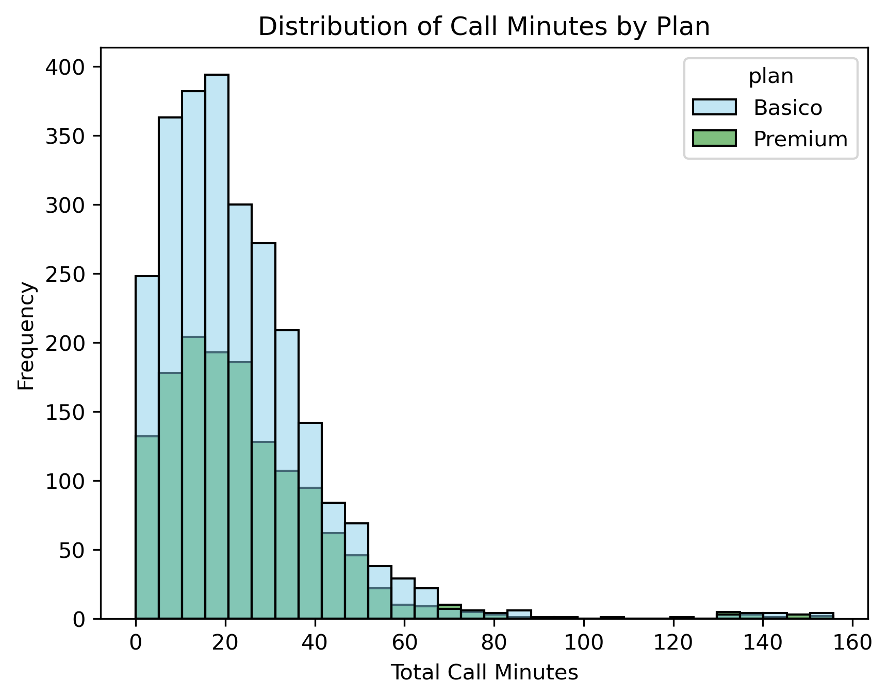
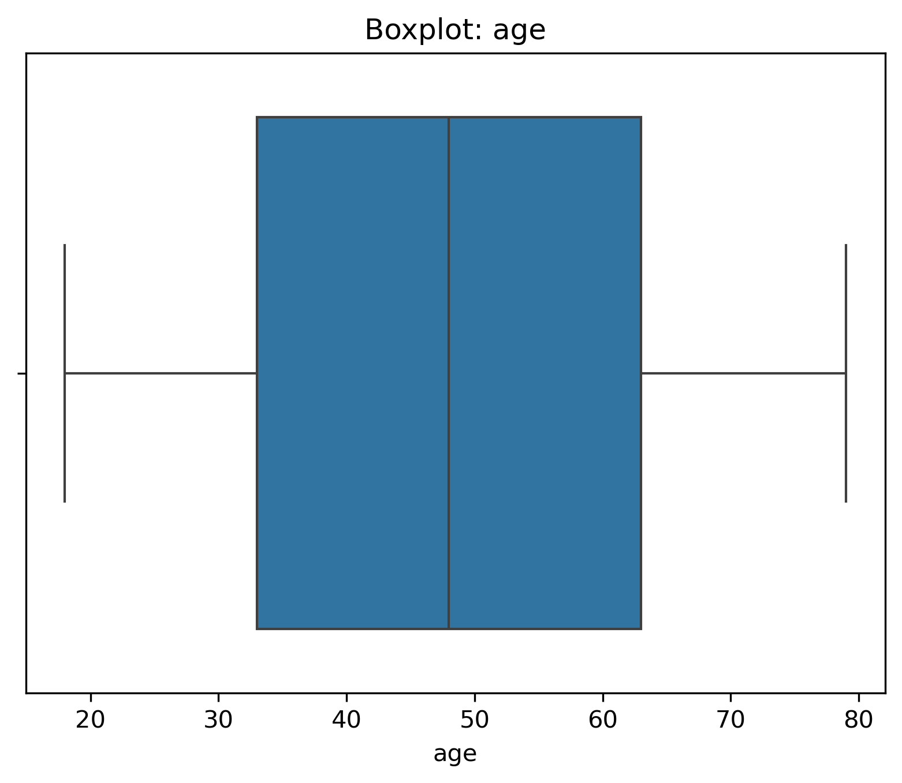
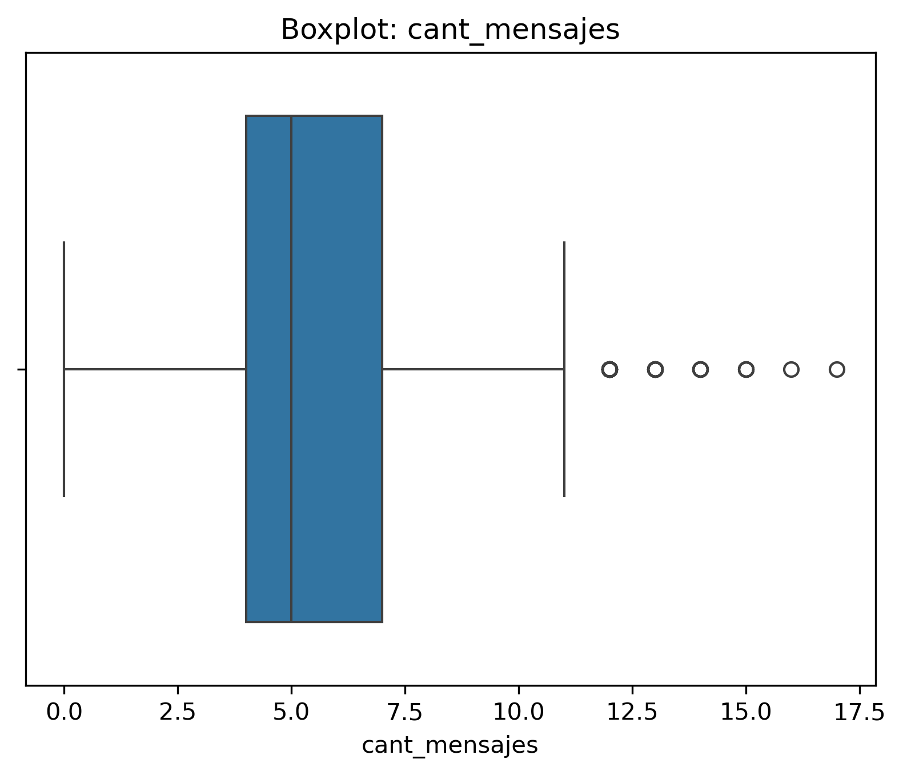
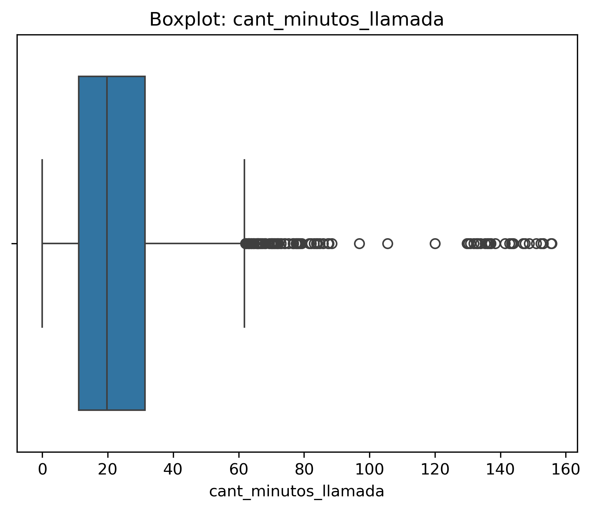

# ConnectaTel Customer Segmentation & Usage Analysis

This project analyzes customer behavior for a telecommunications company in Latin America, ConnectaTel. The goal is to understand usage patterns, identify customer segments, and generate actionable insights to improve product offerings and business strategy.

The analysis focuses on cleaning multi-source datasets, building user-level metrics, and applying exploratory data analysis (EDA) to uncover patterns in customer behavior.

---

#### Tools Used

---

### Key Questions

- What data quality issues exist in the datasets and how can they be resolved?
- How do customers behave in terms of calls, messages, and usage intensity?
- What customer segments can be identified based on usage and age?
- Are there high-value (high-usage) users, and how do they behave?
- What patterns exist in extreme usage (outliers)?
- How can these insights inform better telecom plans and business decisions?

---

### Methodology

#### 1. Data Inspection
- Loaded and explored datasets using `.head()` and `.info()`
- Reviewed structure, data types, and initial inconsistencies

#### 2. Data Cleaning
- Replaced sentinel values (e.g., `-999` in age)
- Handled missing values appropriately based on context
- Converted date columns to datetime format
- Identified and corrected invalid dates (e.g., year 2026)

#### 3. Missing Data Analysis
- Evaluated missing values using `.isna().sum()` and `.mean()`
- Identified structural missingness (MAR) in `duration` and `length`
- Preserved meaningful null values where appropriate

#### 4. Feature Engineering
- Created user-level metrics:
  - Total messages  
  - Total calls  
  - Total call duration  
- Aggregated usage data by `user_id`
- Merged usage metrics with user dataset

#### 5. Exploratory Data Analysis (EDA)
- Analyzed distributions using histograms
- Identified outliers using boxplots and IQR method
- Compared behavior across plan types

#### 6. Customer Segmentation
- Segmented users by:
  - Usage level (Low, Medium, High)
  - Age group (Young, Adult, Senior)
- Visualized segment distributions

---

### Key Findings

- Data contained several quality issues, including sentinel values, missing data, and invalid dates, which were successfully cleaned.
- Missing values in `duration` and `length` were structural (dependent on usage type) and represent valid real-world behavior.
- Most users fall into low to medium usage segments, while a smaller group of high-usage users represents a key business opportunity.
- Outliers were identified primarily on the upper end of usage variables, indicating heavy users rather than data errors.
- No strong relationship was observed between age and plan selection, suggesting behavior is driven more by usage than demographics.
- Premium users tend to show slightly higher usage levels, particularly in call minutes, though differences are not extreme.

---

### Featured Visualizations

#### 1. Age Distribution by Plan  
This histogram shows the distribution of user ages segmented by plan type. The visualization helps assess whether age influences plan selection and highlights the overall demographic spread of users.

---

#### 2. Messages Distribution by Plan  
This histogram illustrates the number of messages sent by users across different plans. The distribution is right-skewed, indicating that most users send a moderate number of messages, while a smaller group exhibits higher messaging activity.

---

#### 3. Calls Distribution by Plan  
This visualization presents the distribution of call counts per user. It reveals that most users make a moderate number of calls, with some higher-usage users creating a slight right skew in the data.

---

#### 4. Call Minutes Distribution by Plan  
This histogram highlights the distribution of total call minutes per user. The strong right skew indicates the presence of high-usage users (outliers), suggesting a segment of customers with intensive service consumption.

### Outlier Detection (Boxplots)

Boxplots were used to identify extreme values across key user and usage variables. These visualizations provide insight into data dispersion and help distinguish between normal behavior and potential anomalies.

---

#### Age Distribution (Boxplot)  
The age variable does not present significant outliers and remains within a realistic range. This indicates consistent and reliable demographic data.

---

#### Messages Distribution (Boxplot)  
The number of messages shows several outliers on the upper end, representing users with higher-than-average messaging activity. These values reflect real usage patterns rather than data errors.

---

#### Calls Distribution (Boxplot)  
The number of calls also presents outliers on the right side, indicating a segment of users with high call frequency. These users represent potential high-value customers.

---

#### Call Minutes Distribution (Boxplot)  
Call minutes show a strong presence of outliers, with some users exhibiting significantly higher usage. These values highlight heavy users and suggest opportunities for premium or usage-based plans.

---

### Business Recommendations

- Develop targeted plans for high-usage users (premium tiers with optimized pricing).
- Introduce mid-tier plans to better capture medium-usage customers.
- Avoid segmenting customers solely based on age, as usage behavior is more informative.
- Leverage usage-based segmentation to personalize offers and improve retention strategies.
- Consider monitoring heavy users separately as a high-value segment.

---

### What I Learned

- Strengthened my ability to clean and validate real-world datasets with multiple issues.
- Learned how to distinguish between missing data errors and structural missingness.
- Improved my skills in feature engineering and user-level aggregation.
- Gained experience in identifying and interpreting outliers in behavioral data.
- Developed the ability to translate data analysis into actionable business insights.
- Reinforced best practices for building structured, reproducible data analysis projects.

---
